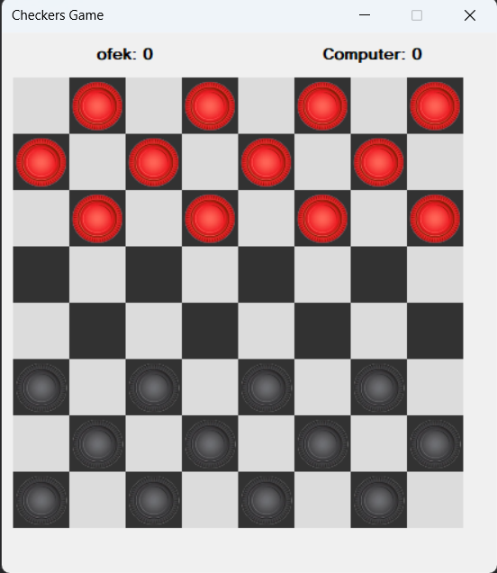

This project was developed as part of an Object-Oriented Programming (OOP) using the .NET Framework and C# course, demonstrating key principles such as **Encapsulation, Abstraction, Composition, and Code Reuse**. It emphasizes modular design, secure data handling, and efficient code organization. Additionally, the project incorporates **event handling** to manage user interactions dynamically, showcasing practical implementation of OOP best practices.

